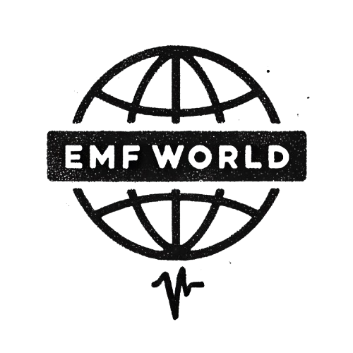

<p align="center">
  
</p>


# EMF-World
An open science project the subject of non-ionizing electromagnetic fields (radiation) and their biological and health effects.

## Sub-projects

* EMF Science Literature
* EMF Limits


## Citation

## Citation

If you use **EMF World** in your research or projects, please cite it as follows:

Author(s). EMF World. GitHub repository, 2024. Available at: [https://github.com/cortexR/EMF-World](https://github.com/cortexR/EMF-World)

Or use this BibTeX entry:

```bibtex
@misc{EMFWorld,
  author = {Author(s) or Team Name},
  title = {EMF World},
  year = {2024},
  publisher = {GitHub},
  journal = {GitHub repository},
  howpublished = {\url{https://github.com/cortexR/EMF-World}},
}

